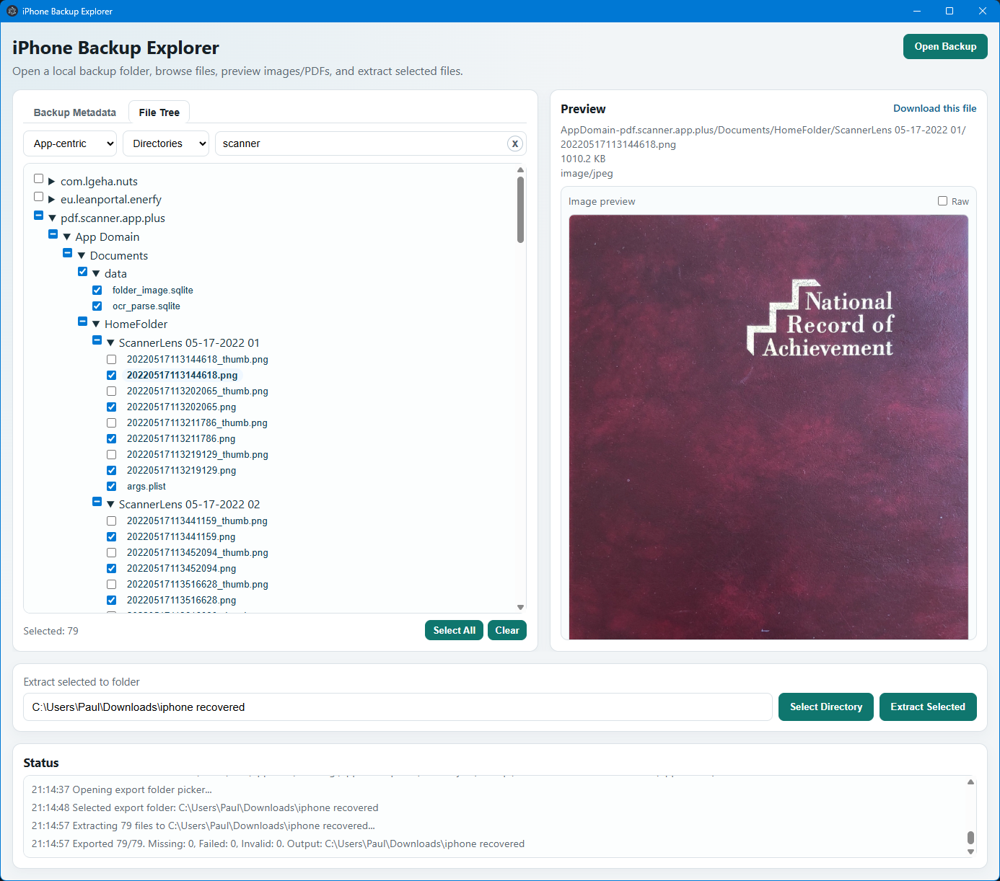

# iphone backup explorer

Local iTunes/iPhone backup explorer with preview and extraction.



## Features

- Opens a backup directory containing `Manifest.db` (plus `Manifest.plist` and `Info.plist` when available).
- Reconstructs a file tree from `domain + relativePath`.
- Supports **App-centric**, **Camera**, **Files**, and **Raw domains** views.
- Previews image/PDF/media files inline, parses plist files, and falls back to text previews.
- Extracts selected files while preserving logical backup paths.

## Requirements

- Node.js 18+.
- Windows for folder-picker UX (`/api/select-*` uses the Windows dialog).

## Security Model

- The backend is loopback-only (`127.0.0.1`) and rejects non-local requests.
- This applies to both web mode and Electron mode.

## Run As Local Web App

1. Install dependencies:

```bash
npm install
```

2. Start the web server:

```bash
npm run start:web
```

3. Open:

```text
http://127.0.0.1:3000
```

## Run As Electron App (Dev)

1. Install dependencies:

```bash
npm install
```

2. If native module binaries need a rebuild for your Electron version:

```bash
npm run rebuild:electron
```

3. Start Electron:

```bash
npm start
```

Notes:
- Electron starts the Express backend in-process on a random loopback port.
- The renderer loads `http://127.0.0.1:<randomPort>`.

## Build Windows Installer / Executable

```bash
npm run dist:win
```

Build output goes to `release/`.
Run the installer generated at:
- `release/iphone-backup-explorer-<version>-x64.exe`

## Usage

1. Click **Open Backup** and choose a backup folder.
2. Switch tree view mode as needed.
3. Browse and select files.
4. Click a file to preview it.
5. Choose an output folder and click **Extract Selected**.

## Notes

- Encrypted backups are detected, but keybag decryption is not implemented.
- Large backups may take some time to index on initial load.
